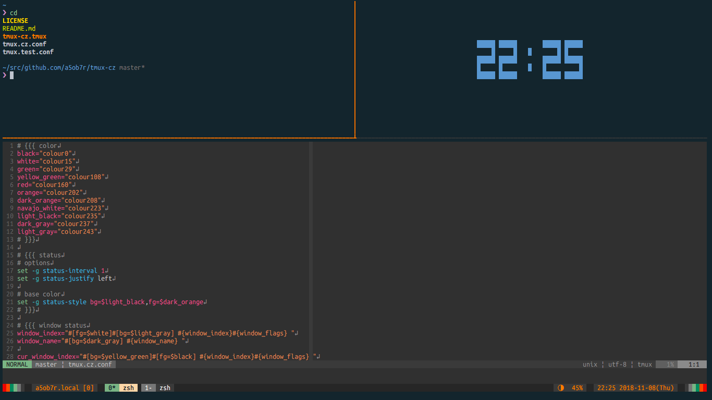

# Tmux CZ
A tmux theme inspired CZ2128 Delta



## Installation
### Installation with [Tmux Plugin Manager](https://github.com/tmux-plugins/tpm) (recommended)
1. Add plugin to the list of TPM plugins in `.tmux.conf`
```tmux
set -g @plugin 'a5ob7r/tmux-cz'
```

2. Hit `prefix + I` to fetch the plugin and source it.

### Manual Installation
1. Clone repository to local.
```shell
$ git clone https://github.com/a5ob7r/tmux-cz.git ~/clone/path
```

2. Add this line to `~/.tmux.conf`
```tmux
run-shell ~/clone/path/tmux-cz.tmux
```

3. Reload `~/.tmux.conf`
```shell
tmux source-file ~/.tmux.conf
```

## Supporting tmux-battery
This theme supports [tmux-battery](https://github.com/tmux-plugins/tmux-battery).
Please list this theme plugin above tmux/battery, if you want to use it.
```tmux
...
# List above tmux/battery
set -g @plugin 'a5ob7r/tmux-cz'
...
set -g @plugin 'tmux-plugins/tmux-battery'
...
```

## License
MIT
